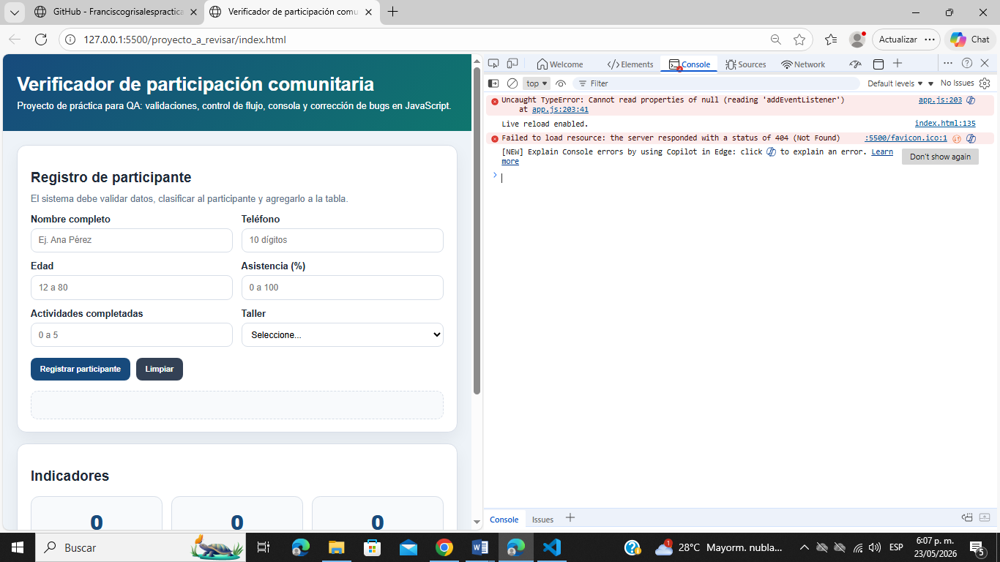
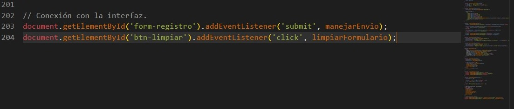
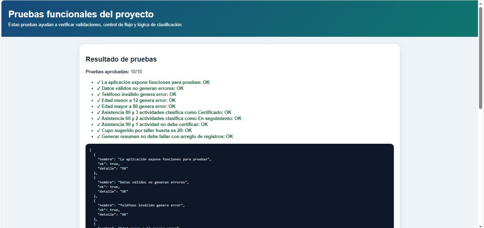

# Plantilla de evidencias

| Evidencia | Archivo o captura | Descripción | Relación con bug/prueba |
| :--- | :--- | :--- | :--- |
| **Consola inicial** |  | Captura de la herramienta de desarrollador donde se observa una excepción no controlada de tipo crítico. | Se asocia con un error de referencia `TypeError` que rompía la ejecución al intentar adjuntar el listener. |
| **Bug priorizado** |  | Enfoque en el código fuente original donde se evidencia el uso de un ID inconsistente con el DOM. | Vinculado directamente con la línea 203 de `app.js`, donde se llamaba a un nodo inexistente. |
| **Corrección aplicada** |  | Captura del script tras realizar la refactorización y actualizar los métodos de selección a los IDs válidos. | Soluciona la vinculación de eventos del formulario y mitiga las fallas por referencias nulas. |
| **Prueba de regresión** |  | Visualización de la suite de pruebas unitarias automatizadas (`tests.html`) ejecutadas en el navegador. | Valida de forma sistemática que todos los módulos lógicos alcanzan un estado óptimo de 10/10. |
| **Sistema funcionando** |  | Captura del entorno tras realizar una inserción manual exitosa en el formulario de la interfaz. | Demuestra la persistencia correcta en la tabla dinámica y la actualización de los indicadores. |
| **Coevaluación**  | 